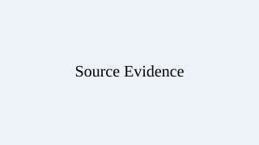

# 合格样例课程

## 第一部分

### 认识证据

[文字]

阅读材料并观察信息来源。

[图片]

[选择]

- 阻塞：是
- 题目：审核信息时首先应该做什么？
- 选项：
  - check-source：核查来源
  - accept：直接接受
- 评价模式：graded
- 正确选项：check-source
- 正确反馈：正确，应先核查来源。
- 错误反馈：请先考虑信息来自哪里。

[填空]

- 阻塞：是
- 题目：写下你判断信息可信度的一个方法。
- 评价模式：reflection
- 评价要求：回答应包含一种具体、可执行的核查方法。
